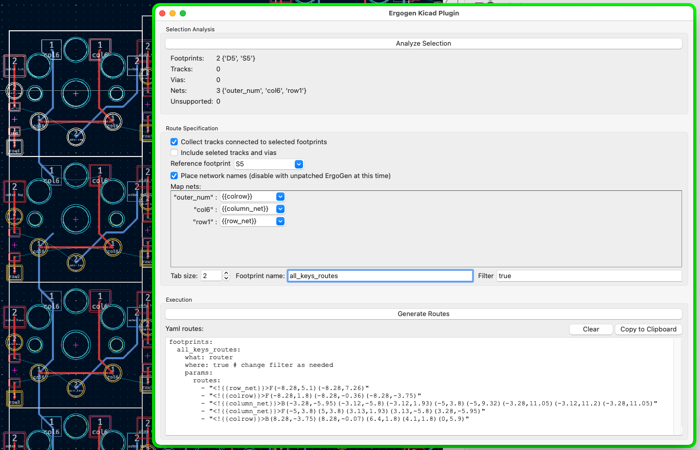

# ErgoGen Plugin

The ErgoGen KiCad plugin allows to easily generate routes that can be embedded in ErgoGen config file using the [Router](./router.md) footprint.
This allows taking ErgoGen one step further by allowing specifying the repetitive routing inside the ErgoGen config file, so that with movement of elements, the routes adjust and don't need to be rerouted again from scratch or use other hacks. 
This shortens board development time and makes it much more fun.

## Example

## Installation

KiCad has a folder for plugin installation. Location is OS dependent and is specified at https://dev-docs.kicad.org/en/python/pcbnew/

Installation can be done in either of two ways:
- Create a symbolic lynk to the ergogen folder inside the plugins folder
- Copy the ergogen folder into the plugins folder under the ergogen folder name

If PCB Editor (aka PcbNew) is open, use from the menu bar Tools => External Plugins => Refresh Plugins. Following that when opening the Tools => External Plugins menu again, ErgoGen plugin will appear there.

## Usage

To use ErgoGen plugin run it from the PCB Editor menu Tools => External Plugins and selecting the ErgoGen plugin from the submenu that appears. 
A new window will open that can run side by side together with pcbnew.

The plugin works base on a selection of elements done in the PCB.

The routing is done relative to a footprint placed on the PCB. So if for example there is routing for a key, the routing generated using the Router footprint will be relative to the key. 
If the key moves or rotates the routes will move together with the key.

When generating the configuration yaml, a footprint has to be specified as a reference footprint and all routes are calculated relative to it at its Zero orientation.

Therefore, when making a selection at least one footprint has to be selected. If several are selected one has to be chosen later as the reference footprint.

**VERY IMPORTANT** : ErgoGen supports rotating and positioning in two stages - first at point definition and then at footprint definition. ErgoGen plugin can't currently tell if the reference-footprint rotation and position on the PCB is due to point rotation/shift or due to the additional footprint rotation/shift. It only sees the final rotation/position. It calculates the tracks/vias location relative to the footprint assuming that at build time it will be positioned in the same way as the reference footprint (same position and rotation). Therefore, if the reference footprint had additional rotation through footprint definition, it should be applied to the router footprint as well or the routes will be placed based on the posiion alone. 

The general flow of the plugin usage is:

1. Generate the ErgoGen board w/o the required layouts using ErgoGen
1. Open it in PCB Editor and open the ErgoGen plugin
1. Select relevant footprints/tracks/vias in the PCB
1. Press "Analyze Selection" to fetch selection and adjust UI based on that
1. Update the Routes Specification with required information
1. Generate the yaml config
1. Review the result to see it makes sense
1. Copy result to the clipboard
1. Paste into the ErgoGen config file in the footprints section
1. Generate a new PCB using ErgoGen and review it (preferably to a new file and open it with a second PCB Editor instance),

## Detailed UI Description

### Stay On Top button
Sometimes it is convinient to have the plugin window stay on top of KiCad window. Setting the `Stay On Top` as active by pressing this button switches to that mode. Pressing the button again returns to normal behavior. This was tested to work on Mac.

### Selection Analysis Selection
- **Analyze Selection Button** - pressing this button triggers the plugin to go through the selection and fetch relevant information.
Some of it is displayed right below the button for informative purpose only.
This also alters some of the settings in the Route Specification section.
Note that if selection is changed, this has to be executed again before generating routes to avoid routing mistakes.
- **Informative section below the button** - contains a summary of the selected items. Note that these are NOT the elements that will be routed, only the initial selection driving it. 
Also note that "unsupported" items will be ignored, it doesn't cause any issue selecting unsupported elements.

### Selection Tools
The below tools are shortcuts to common KiCad selection patterns that are very helpful for the workflow when using ErgoGen KiCad plugin and the router footprint for routing the board. For more details for a productive workflow see below.
- Lock all Tracks/Vias - set all tracks and vias as locked
- Select Unlocked Tracks/Vias - selects all tracks and vias that aren't locked
- Select Connected Footprints (to Tracks/Vias) - **ADDS** to the selection the footprints that are directly connected to the selected tracks/vias

### Route Specifications
- **Collect tracks connected to selected footprints** - if this selection is checked then the plugin will follow tracks coming out of ALL selected footprint's pads.
It is important in such case to disconnedt tracks that you don't want to be included in the routing of the PCB, especiall so not to accidentally route multuple keys insteaf of just one
- **Include selected tracks and vias** - if checked the selected tracks and vias will be included in the routing. Sometimes it is technically easier to select areas for selecting footprings to be routed, but the selected tracks/vias are not of interest in the routes
- Include locked tracks and vias - specify whether to include locked tracks and vias in the items to route. Note that the process of collecting tracks collects also through connection to locked items, but the items themselves are not included in the route. This is useful for iterating, see Tips and Best Practices section below.
- **Reference Footprint** - Select the footprint which all routing will be relative to as explained above
- **Place network names** - if checked the plugin will place explicit network reference for the Router footprint to include in the PCB tracks (this has some advantages, not all are clear at this time). For this to work it requires at this time a patched ErgoGen that include the following PR: https://github.com/ergogen/ergogen/pull/109 .
When not checked, the route will show the net as a remark, this makes it easier to identify which route corresponds to what on the PCB, it is sometimes useful to know
- **Map nets** - This list allows renaming network names, mostly useful to map the selected footprint nets to the ErgoGen net templates
- **Tab size** - The tab size to use when generating the yaml, so copy/paste will be easy
- **Footprint name** - The name to give the yaml section. This field is randomly generated but better to rename as there is no gurantee to not conflict with other names for the same board
- **Filter** - Allows modifying the filter that will appear in the yaml, so multiple iterations don't reuire re-editing of this in the yaml again and again after every iteration

### Execution
- **Generate Routes Button** - Triggers the actual process of yaml generation. Results (or issues) will be presented in the *Yaml Routes* text editor below
- **Clear Button** - Replaces the yaml if generated with basic usage explanations
- **Copy to Clipboard** - Copies the yaml ready to paste into the ErgoGen config file with proper indentation. Note that this is not just a copy paste of the text in the edit but it goes through some indentation modifications for a single click paste into yaml.

## Tips and (Best?) Practices
- Think carefully how to organize the router-configs to separate routes in a way that creates managable/logical configs as well as support easy changes to the board without a complete rerouting.
  
  A few examples:
  - Separate routing of the key diode related routes from the switch related routes, in case in the future it's required to move only the diodes. This way it won't be required to reroute the entire switch if the diode moves. Routes can still be in relation to the key point/location, but as a separate router footprint configuration
  - Include a separate router-config for the vertical column connection between switches so these can be placed only on switches that are above other switches and not on the bottom row (using filters)
  - Use a separate router-config for the connection of rows that have same stagger across columns, sometimes it is possible to split the row connection to the router-config part that is suitable for all rows and another part that is suitable for just some of the rows 
  - For the thumb area, it is possible to use the same switch routes but connecting the switches among themselves can be separate, but not together with the connection of the thumb cluster to the rest of the board. This way moving the entire thumb cluster as a whole won't require re-routing

- Remember to take advantage of ErgoGen filtering capabilities to route only some of the elements with specific routes

### Workflow using KiCad Lock mechanism
It is very convinient to use KiCad locking of tracks/vias for a productive workflow:
1. At any given routing session work on a single router footprint config
1. Set the `locked` param of all router sections except the one being worked on to `true`
1. Route to generate config using the KiCad plugin
1. Add to ergogen config file (with `locked` param of that section as false)
1. Generate the pcb using ergogen and reopen it
1. Change/enhance/remove Routes, basically jump back to step 3 and iterate until happy with the Results
1. Once satisfies with the results, set the locked property of that section to true and move to the next one

In the same way it's possible to edit an existing configuration, just set the router footprint you want to edit to `locked: false`, all others to true and iterate on editing it until done.

## Troublesho ting
KiCad plugin is able to output detailed logs, in the helper.py just need to set the level of logs from WARN to DEBUG and a file named ergogen.log will be created in the ergogen plugin location containing the logs.
