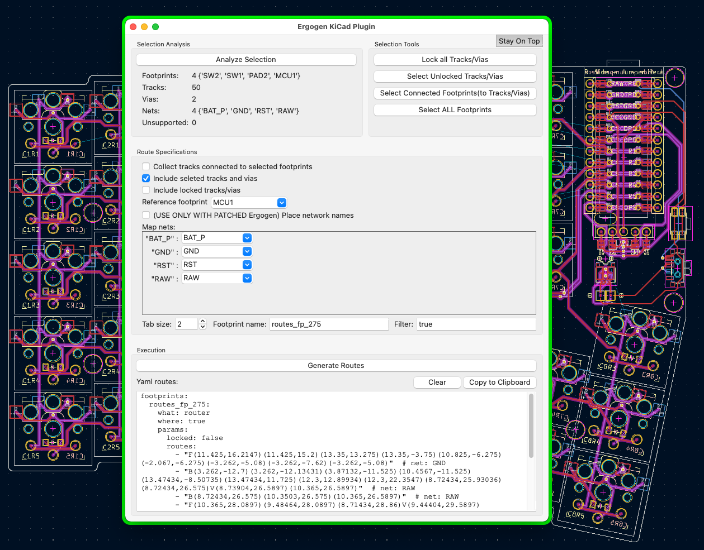

# ErgoGen Plugin

The ErgoGen KiCad plugin allows to easily generate routes that can be embedded in ErgoGen config file using the [Router](./router.md) footprint.
This allows taking ErgoGen one step further by allowing specifying the repetitive routing inside the ErgoGen config file, so that with movement of elements, the routes adjust and don't need to be rerouted again from scratch or use other hacks. 
This shortens board development time and makes it much more fun.

## Example

## Installation

KiCad has a folder for plugin installation. Location is OS dependent and is specified at https://dev-docs.kicad.org/en/python/pcbnew/

Installation can be done in either of two ways:
- Create a symbolic lynk to the ergogen folder inside the plugins folder
- Copy the ergogen folder into the plugins folder under the ergogen folder name

If PCB Editor (aka PcbNew) is open, use from the menu bar Tools => External Plugins => Refresh Plugins. Following that when opening the Tools => External Plugins menu again, ErgoGen plugin will appear there.

## Usage

To use ErgoGen plugin run it from the PCB Editor menu Tools => External Plugins and selecting the ErgoGen plugin from the submenu that appears. 
A new window will open that can run side by side together with pcbnew.

The plugin works base on a selection of elements done in the PCB.

The routing is done relative to a footprint placed on the PCB. So if for example there is routing for a key, the routing generated using the Router footprint will be relative to the key. 
If the key moves or rotates the routes will move together with the key.
When generating the configuration yaml, a footprint has to be specified as a reference footprint and all routes are calculated relative to it at its Zero orientation.

Therefore, when making a selection at least one footprint has to be selected. If several are selected one has to be chosen later as the reference footprint.

The general flow of the plugin usage is:

1. Generate the ErgoGen board w/o the required layouts using ErgoGen
1. Open it in PCB Editor and open the ErgoGen plugin
1. Select relevant footprints/tracks/vias in the PCB
1. Press "Analyze Selection" to fetch selection and adjust UI based on that
1. Update the Routes Specification with required information
1. Generate the yaml config
1. Review the result to see it makes sense
1. Copy result to the clipboard
1. Paste into the ErgoGen config file in the footprints section
1. Generate a new PCB using ErgoGen and review it (preferably to a new file and open it with a second PCB Editor instance),

## Detailed UI Description

### Selection Analysis Selection
- **Analyze Selection Button** - pressing this button triggers the plugin to go through the selection and fetch relevant information.
Some of it is displayed right below the button for informative purpose only.
This also alters some of the settings in the Route Specification section.
Note that if selection is changed, this has to be executed again before generating routes to avoid routing mistakes.
- **Informative section below the button** - contains a summary of the selected items. Note that these are NOT the elements that will be routed, only the initial selection driving it. 
Also note that "unsupported" items will be ignored, it doesn't cause any issue selecting unsupported elements.

### Route Specification
- **Collect tracks connected to selected footprints** - if this selection is checked then the plugin will follow tracks coming out of ALL selected footprint's pads.
It is important in such case to disconnedt tracks that you don't want to be included in the routing of the PCB, especiall so not to accidentally route multuple keys insteaf of just one
- **Include selected tracks and vias** - if checked the selected tracks and vias will be included in the routing. Sometimes it is technically easier to select areas for selecting footprings to be routed, but the selected tracks/vias are not of interest in the routes
- **Reference Footprint** - Select the footprint which all routing will be relative to as explained above
- **Place network names** - if checked the plugin will place explicit network reference for the Router footprint to include in the PCB tracks (this has some advantages, not all are clear at this time). For this to work it requires at this time a patched ErgoGen that include the following PR: https://github.com/ergogen/ergogen/pull/109 .
When not checked, the route will show the net as a remark, this makes it easier to identify which route corresponds to what on the PCB, it is sometimes useful to know
- **Map nets** - This list allows renaming network names, mostly useful to map the selected footprint nets to the ErgoGen net templates
- **Tab size** - The tab size to use when generating the yaml, so copy/paste will be easy
- **Footprint name** - The name to give the yaml section. This field is randomly generated but better to rename as there is no gurantee to not conflict with other names for the same board
- **Filter** - Allows modifying the filter that will appear in the yaml, so multiple iterations don't reuire re-editing of this in the yaml again and again after every iteration

### Execution
- **Generate Routes Button** - Triggers the actual process of yaml generation. Results (or issues) will be presented in the *Yaml Routes* text editor below
- **Clear Button** - Replaces the yaml if generated with basic usage explanations
- **Copy to Clipboard** - Copies the yaml ready to paste into the ErgoGen config file with proper indentation. Note that this is not just a copy paste of the text in the edit but it goes through some indentation modifications for a single click paste into yaml.

