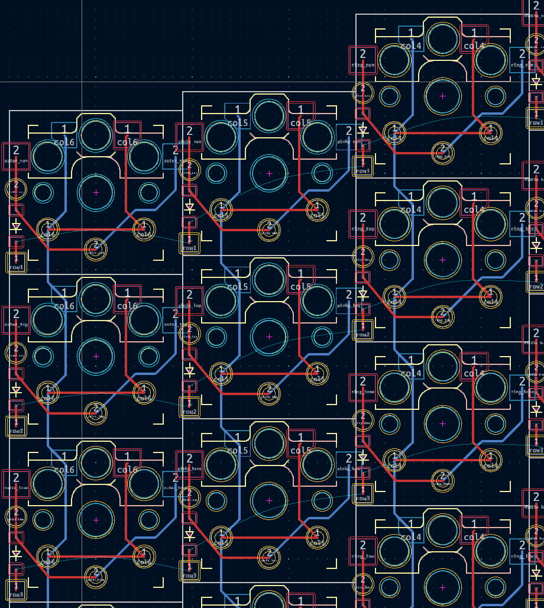

# Router footprint

The Router footprint provides basic routing capabilities including 
- Routes
- Vias

It is useful especially since there are tens of keys per keyboard which have exact same routing and whenever a change needs to be made to ErgoGen config, w/o any tricks, rerouting is required.
This footpring allows including the basic keys routing (and maybe more) into the ErgoGen config.

Most important: this footprint is one part of a more complete Ergogen routing solution that includes also the [Ergogen KiCad plugin](ergogen_kicad_plugin.md)

## Example
```
    footprints:
      row_col_route:
        what: router
        where: true
        params:
          net: "{{colrow}}"
          route: "f(-8.275,-3.75)(-8.275,-0.36)(-8.275,1.8)(-4.875,5.9)(0,5.9)b(4.1,1.8)(6.2,1.8)(8.275,-0.275)(8.275,-3.75)"
      row_route:
        what: router
        where: true
        params:
          net: "{{row_net}}"
          route: "f(-8.275,5.1)(-8.275,7.26)"
      column_route:
        what: router
        where: true
        params:
          net: "{{column_net}}"
          route: "b(-3.275,-5.95)(-3.125,-5.8)(-3.125,1.925)(-5,3.8)f(5,3.8)(3.125,1.925)(3.125,-5.8)(3.275,-5.95)"
      column_route_down:
        what: router
        where: [ [-/.*bottom/, -/thumb.*/, -/matrix_inner_low/] ]
        params:
          net: "{{column_net}}"
          route: "b(-5,3.8)(-5,9.325)(-3.275,11.05)" 

```


## Supported Params
```
  params: {
    net: { type: "net", value: "" },
    width: { type: "number", value: 0.25 },
    route: { type: "string", value: "" },
    routes: { type: "array", value: [] },
    via_size: { type: "number", value: 0.8 },
    via_drill: { type: "number", value: 0.4 },
    locked: false,
  }
```

- `width`, `via_size`, `via_drill` - self explanatory - optional with default keycad 7.0 values
- net - allows specifying a net for all routes in this footprint, which is limiting because for several routes of different networks that wou mean several router footprints. However, if 'no net' is supplied (default if net param not specified) then KiCad will fill in those missing nets when file is opened. 
- `routes` - an array of routes based on the syntax described below, each stands by its own except they all share other params (net, ...)
- `route` - allows adding a single route using same syntax, but on a single row in a more concise format and probably the common case
- locked - generates the routes and vias as locked in KiCad - very useful for easy workflow

### Route Syntax
A route is a string that describe how to route using one letter *commands* and positions. It follows to some extent KiCad key presses to make it easy to remember and use:
- `b` - route on the back layer - there is no default layer to avoid mistakes
- `f` - route on the front layer
- `v` - place a via and switch layer
- 'x' - start a new route (if layer is set, stays on the same layer, just like in keycad)
- `(x_pos number,y_pos number)` - route to the given position (relative to the ErgoGen point). If it is the first occurence in the route or if after `x` *command* then it places the cursor in the specific point. It is similar to logo programming, except that position is absolute and not relative for a reason.

